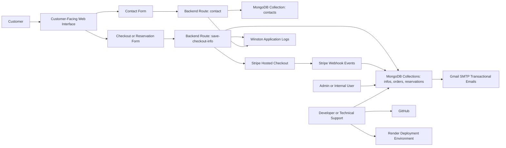

# Data Flow Map

## Privacy Impact & Data Handling Risk Assessment: Customer-Facing Reservation Platform

## 1. Purpose

The purpose of this document is to map how personal information moves through the customer-facing reservation and payment-related application.

This document explains:

* Where personal information is collected
* Which workflows process personal information
* Which backend routes and system components are involved
* Where personal information is stored
* Which internal roles may access personal information
* Which third-party services process or transmit personal information
* Where privacy-relevant risks appear in the data flow
* Which safeguards are observed or expected
* Where retention and deletion considerations should be documented

This document supports later privacy assessment deliverables, including the PIA-style Privacy Assessment, Canadian Privacy Framework Mapping, Privacy Safeguards Gap Log, Vendor Processing Assessment, Privacy Risk Register, Remediation Tracker, and Evidence Index.

## 2. Scope

This data flow map covers the following workflows:

1. Reservation workflow
2. Contact form workflow
3. Checkout and payment workflow
4. Admin and internal access workflow
5. Email communication workflow
6. Logging and monitoring workflow
7. Vendor and hosting dependency workflow

This document focuses on privacy-relevant data movement. It does not perform penetration testing, full source code review, network security assessment, formal legal analysis, or regulatory compliance certification.

## 3. System Context

The assessed system is a sanitized customer-facing reservation and payment-related web application.

The application allows customers to:

* Browse pottery classes or services
* Select available reservation options
* Submit reservation-related personal information
* Submit contact inquiries
* Proceed to checkout without customer authentication
* Complete payment through Stripe hosted checkout
* Receive transactional email communications

The application environment includes:

| Component                     | Role in Data Flow                                                                             |
| ----------------------------- | --------------------------------------------------------------------------------------------- |
| Customer-facing web interface | Collection point for reservation, contact, and checkout information                           |
| Backend/API logic             | Processes submitted customer data and payment-related events                                  |
| MongoDB database              | Stores reservation, contact, order, and customer information records                          |
| Stripe hosted checkout        | Processes payment details externally                                                          |
| Stripe webhook                | Returns payment-related status or transaction events to the application                       |
| Gmail SMTP                    | Sends order confirmations, contact responses, and checkout-related notifications              |
| Cloudinary                    | Stores or serves media content, primarily non-sensitive in this context                       |
| Render                        | Hosts or deploys the application environment                                                  |
| GitHub                        | Supports source code and deployment workflow                                                  |
| Winston logging               | Captures application errors, system events, and selected request or security-related activity |

## 4. Personal Information in Scope

The following personal information or privacy-relevant data elements may appear in the data flows:

| Data Element                             | Primary Workflow                                                              |
| ---------------------------------------- | ----------------------------------------------------------------------------- |
| First name                               | Reservation, checkout, contact                                                |
| Last name                                | Reservation, checkout, contact                                                |
| Email address                            | Reservation, checkout, contact, email communication, payment-related workflow |
| Contact number                           | Reservation, checkout, contact                                                |
| Address                                  | Checkout, reservation, order-related workflow                                 |
| Company information                      | Checkout or contact, if provided                                              |
| Reservation details                      | Reservation and checkout workflow                                             |
| Contact message content                  | Contact form workflow                                                         |
| Payment status                           | Checkout and payment workflow                                                 |
| Stripe transaction or payment reference  | Third-party payment workflow                                                  |
| Order record                             | Payment completion and internal recordkeeping                                 |
| Admin/internal user identifiers          | Internal access and accountability workflow                                   |
| System logs and access records           | Logging and monitoring workflow                                               |
| IP, device, or session metadata          | Technical logging or security workflow, if collected                          |
| Payment amount or order total            | Checkout and payment workflow                                                 |
| Privacy policy acknowledgement indicator | Checkout or form submission workflow, if captured                             |

## 5. High-Level Personal Information Flow

At a high level, personal information moves through the system as follows:



## 6. Workflow 1: Reservation Workflow

### 6.1 Flow Description

Customers access the application, browse available classes or services, select a reservation option, and submit reservation-related information.

Typical flow:

```text
Customer
to Customer-Facing Web Interface
to Reservation or Checkout Form
to Backend Processing
to MongoDB reservations and related records
to Admin/Internal Review
```

### 6.2 Personal Information Involved

| Data Element        | Description                                                            |
| ------------------- | ---------------------------------------------------------------------- |
| First name          | Customer identifier used for reservation handling                      |
| Last name           | Customer identifier used for reservation handling                      |
| Email address       | Used for booking communication and confirmation                        |
| Contact number      | Used for customer communication or operational follow-up               |
| Reservation details | Class, date, time, number of participants, and related booking details |
| Address             | May be captured in checkout or order-related context                   |
| Company information | May be captured if provided by the customer                            |

### 6.3 Storage Points

Reservation-related information may be stored in:

* MongoDB reservations collection
* MongoDB infos collection
* MongoDB orders collection where payment/order linkage exists
* Email communication records, if included in customer notifications

### 6.4 Access Points

Possible access roles include:

* Business Owner
* Admin/Internal User
* Application Owner
* Developer or Technical Support, if database or environment access is available

### 6.5 Privacy Risk Points

| Risk Point                                                                       | Related Finding |
| -------------------------------------------------------------------------------- | --------------- |
| Customers can initiate reservation or checkout actions without authentication    | PF-002          |
| Reservation records may be accessible through broad internal or developer access | PF-002          |
| Some direct identifiers may be stored in plaintext                               | PF-001          |
| Reservation retention and deletion rules may not be clearly documented           | PF-005          |
| Access to reservation records may not be fully logged                            | PF-003          |

### 6.6 Safeguards and Gaps

Observed or expected safeguards include:

* Field-level encryption for selected contact fields
* Stripe hosted checkout for payment processing
* Application-level validation and security middleware where implemented
* System-level logging through Winston

Known gaps include:

* No customer authentication for booking and checkout actions
* No formal RBAC model
* Inconsistent field-level protection across personal information fields
* Limited user or admin activity logging
* Incomplete retention and deletion documentation

## 7. Workflow 2: Contact Form Workflow

### 7.1 Flow Description

Customers submit inquiries through the contact form. The information is processed by the backend contact route and stored in the application database.

Typical flow:

```text
Customer
to Contact Form
to Backend Route: contact
to MongoDB contacts collection
to Email or Internal Follow-Up
to Admin/Internal Review
```

### 7.2 Personal Information Involved

| Data Element            | Description                              |
| ----------------------- | ---------------------------------------- |
| First name              | Customer identifier, if collected        |
| Last name               | Customer identifier, if collected        |
| Email address           | Used to respond to the inquiry           |
| Contact number          | Used for customer follow-up, if provided |
| Company information     | Optional business-related identifier     |
| Contact message content | Free-text inquiry content                |

### 7.3 Storage Points

Contact-related information may be stored in:

* MongoDB contacts collection
* Gmail SMTP or email records, if inquiry responses are sent or retained
* Application logs, if request activity or error information is captured

### 7.4 Privacy Risk Points

| Risk Point                                                                          | Related Finding |
| ----------------------------------------------------------------------------------- | --------------- |
| Contact message content may contain unexpected personal information                 | PF-005          |
| Email and contact number may be encrypted, while other identifiers remain plaintext | PF-001          |
| Internal access to contact records may not be role-limited                          | PF-002          |
| Access to contact submissions may not be logged in a structured way                 | PF-003          |
| Retention period for contact inquiries may not be documented                        | PF-005          |

### 7.5 Safeguards and Gaps

Observed or expected safeguards include:

* Field-level protection for selected contact fields
* Backend route handling for contact submission
* Email communication for customer response
* System-level logging for application events

Known gaps include:

* Free-text content may contain sensitive or unnecessary information
* No documented retention trigger for resolved inquiries
* No structured logging of internal access to contact messages
* No centralized evidence trail for privacy handling of contact records

## 8. Workflow 3: Checkout and Payment Workflow

### 8.1 Flow Description

Customers submit checkout-related information and are redirected to Stripe hosted checkout for payment processing.

Typical flow:

```text
Customer
to Checkout Form
to Backend Route: save-checkout-info
to MongoDB infos, orders, or reservations collections
to Stripe Hosted Checkout
to Stripe Payment Processing
to Stripe Webhook Events
to Application Order or Reservation Update
to Gmail SMTP Confirmation Email
```

### 8.2 Personal Information Involved

| Data Element                            | Description                                                        |
| --------------------------------------- | ------------------------------------------------------------------ |
| First name                              | Customer identifier                                                |
| Last name                               | Customer identifier                                                |
| Email address                           | Used for checkout, payment-related communication, and confirmation |
| Contact number                          | Customer contact information                                       |
| Address                                 | Customer address, if collected during checkout                     |
| Company information                     | Optional customer or business-related information                  |
| Reservation details                     | Booking information connected to checkout                          |
| Payment status                          | Paid, unpaid, pending, failed, refunded, or comparable status      |
| Stripe transaction or payment reference | External payment reference or transaction identifier               |
| Order record                            | Internal record created after payment-related event                |
| Payment amount or order total           | Transaction-related operational information                        |

### 8.3 Internal and External Processing Boundary

| Processing Area        | Data Handling Role                                                                                                                      |
| ---------------------- | --------------------------------------------------------------------------------------------------------------------------------------- |
| Internal application   | Collects customer and reservation information, creates or updates reservation/order records, stores selected payment-related references |
| Stripe hosted checkout | Processes payment details externally                                                                                                    |
| Stripe webhook         | Sends payment status or transaction event information back to the application                                                           |
| MongoDB                | Stores internal reservation, order, customer, and payment-related reference information                                                 |
| Gmail SMTP             | Sends confirmation or checkout-related notifications                                                                                    |

### 8.4 Important Payment Boundary

The internal application is not assessed as storing full cardholder data. Payment details are processed externally through Stripe hosted checkout.

However, payment-related metadata, status, transaction references, customer identifiers, and reservation/order linkage may still be privacy-relevant when connected to an identifiable customer.

### 8.5 Privacy Risk Points

| Risk Point                                                                                     | Related Finding |
| ---------------------------------------------------------------------------------------------- | --------------- |
| Internal system should document which payment-related data is retained after Stripe processing | PF-004          |
| Payment metadata may link customer identity, reservation details, and payment status           | PF-004          |
| Retention of payment references may not be clearly documented                                  | PF-005          |
| Vendor processing documentation may be incomplete                                              | PF-004          |
| Payment or order records may be accessible through broad developer or admin access             | PF-002          |
| Payment workflow changes may be deployed without formal review                                 | PF-007          |

### 8.6 Safeguards and Gaps

Observed or expected safeguards include:

* Stripe hosted checkout for external payment processing
* No internal storage of full cardholder data based on assessment documentation
* Payment confirmation through webhook event handling
* Email confirmation to customer after successful payment

Known gaps include:

* No formal vendor processing assessment documented at the application level
* No centralized record of what payment metadata remains internally
* Limited evidence of vendor due diligence or ongoing monitoring
* No formal change management controls for payment-related workflow changes

## 9. Workflow 4: Admin and Internal Access Workflow

### 9.1 Flow Description

Internal users and technical personnel may access system components or data stores to support operations, development, deployment, or troubleshooting.

Typical flow:

```text
Business Owner or Admin
to Stripe or Gmail or Operational Records

Developer or Technical Support
to GitHub
to Render
to Environment Variables
to MongoDB connection
to Application Data or Configuration
```

### 9.2 Access Points

| Access Point                    | Access Relevance                                                                                       |
| ------------------------------- | ------------------------------------------------------------------------------------------------------ |
| MongoDB database                | May contain reservation, contact, customer, order, and payment-related reference data                  |
| GitHub repository               | Contains source code and deployment-related logic                                                      |
| Render deployment environment   | Contains deployment configuration and environment variables                                            |
| Environment variables           | May include database connection strings, encryption keys, API keys, email credentials, and Stripe keys |
| Stripe dashboard or account     | Payment processing and transaction information                                                         |
| Gmail administration or mailbox | Customer communication and transactional email records                                                 |
| Cloudinary account              | Media content and cloud/media service access                                                           |

### 9.3 Privacy Risk Points

| Risk Point                                                                                       | Related Finding |
| ------------------------------------------------------------------------------------------------ | --------------- |
| No formal authentication or RBAC model exists for application-level access governance            | PF-002          |
| Developer may have broad access across application, infrastructure, credentials, and data layers | PF-002          |
| Access provisioning, approval, role assignment, and revocation are not formally documented       | PF-002          |
| Internal or developer access to customer PII may not be monitored                                | PF-003          |
| Secrets access may increase privacy breach exposure if credentials are misused or compromised    | PF-001, PF-002  |
| Lack of structured SoD may concentrate access across multiple system layers                      | PF-002          |

### 9.4 Safeguards and Gaps

Observed or expected safeguards include:

* External platform controls within Stripe, Gmail, GitHub, Render, or Cloudinary
* Environment variables used instead of hardcoding secrets into source code
* Gitignore exclusion of local `.env` files from repository

Known gaps include:

* Broad developer access to database, source code, deployment, and environment configuration
* No centralized access governance model
* No formal access approval or review process
* No formal RBAC model
* No structured logging of internal access to personal information
* No documented segregation of duties model for privacy-relevant access

## 10. Workflow 5: Email Communication Workflow

### 10.1 Flow Description

The application uses Gmail SMTP or a comparable email service to send transactional communications.

Typical flow:

```text
Application Event
to Email Generation Logic
to Gmail SMTP
to Customer Email Address
to Email Records or Mailbox
```

### 10.2 Email Types

Email communications may include:

* Order confirmations
* Contact form responses
* Checkout-related notifications
* Reservation-related updates

### 10.3 Personal Information Involved

Email communications may include:

* Customer name
* Email address
* Phone number, if included in message content
* Address, if included in order or checkout details
* Reservation details
* Payment or order confirmation information
* Contact inquiry content, if included in reply thread

### 10.4 Privacy Risk Points

| Risk Point                                                                                          | Related Finding |
| --------------------------------------------------------------------------------------------------- | --------------- |
| Email records may contain copies of customer personal information outside the main database         | PF-005          |
| Retention of email records may not match database retention expectations                            | PF-005          |
| Access to Gmail mailbox or admin functions may not be integrated into centralized access governance | PF-002          |
| Email content may include more personal information than necessary                                  | PF-005          |
| Evidence of email retention or deletion rules may be incomplete                                     | PF-006          |

### 10.5 Safeguards and Gaps

Observed or expected safeguards include:

* Use of Gmail SMTP for transactional email delivery
* External email platform authentication and account-level controls

Known gaps include:

* No centralized documentation of email retention expectations
* No formal mapping of what personal information appears in each email type
* No documented review of whether transactional emails minimize unnecessary personal information
* No centralized evidence trail for email-related privacy handling

## 11. Workflow 6: Logging and Monitoring Workflow

### 11.1 Flow Description

The application uses Winston-based logging to capture system events.

Typical flow:

```text
Application Event
to Winston Logger
to error.log or combined.log
to Technical Review or Troubleshooting
```

### 11.2 Events Potentially Logged

Logs may include:

* Application errors
* Database connection events
* Payment and reservation activity
* Security-related events such as CSRF violations
* Selected request or system activity
* Partially masked personal information, if included in logged events

### 11.3 Privacy Risk Points

| Risk Point                                                                                              | Related Finding |
| ------------------------------------------------------------------------------------------------------- | --------------- |
| No structured user access logging exists                                                                | PF-003          |
| No structured administrative activity logging exists                                                    | PF-003          |
| Logs may not support investigation of access, modification, export, or deletion of personal information | PF-003          |
| Logs may contain partially masked or unexpected personal information                                    | PF-001, PF-003  |
| Log retention expectations may not be documented                                                        | PF-005          |
| Evidence supporting logging coverage may not be centralized                                             | PF-006          |

### 11.4 Safeguards and Gaps

Observed or expected safeguards include:

* Winston-based logging
* error.log and combined.log
* Logging of application errors and selected system events
* Some masking or partial masking where implemented

Known gaps include:

* No dedicated logging for user access
* No dedicated logging for administrative actions
* No structured audit trail for personal information view, modification, export, or deletion
* No documented log retention period
* Limited ability to investigate unauthorized access to personal information

## 12. Workflow 7: Vendor and Hosting Dependency Flow

### 12.1 Flow Description

The application depends on several third-party or external platforms.

Typical dependency flow:

```text
Application
to Stripe for payment processing
to Gmail SMTP for transactional email
to Cloudinary for media handling
to Render for hosting and deployment
to GitHub for source control and deployment workflow
to MongoDB or database hosting environment for data storage
```

### 12.2 Vendor Dependencies

| Vendor / Dependency                | Function                               | Privacy-Relevant Consideration                                        |
| ---------------------------------- | -------------------------------------- | --------------------------------------------------------------------- |
| Stripe                             | Hosted checkout and payment processing | Third-party payment processing and internal payment metadata boundary |
| Gmail SMTP                         | Transactional email delivery           | Customer communication and email record retention                     |
| Cloudinary                         | Media handling                         | Primarily non-sensitive media handling in this context                |
| Render                             | Hosting and deployment environment     | Environment configuration and deployment access                       |
| GitHub                             | Source control and deployment workflow | Change governance and secrets management                              |
| MongoDB / database hosting context | Application data storage               | Storage, access, backup, and retention considerations                 |

### 12.3 Privacy Risk Points

| Risk Point                                                                                             | Related Finding |
| ------------------------------------------------------------------------------------------------------ | --------------- |
| No formal vendor risk assessment or due diligence record is documented for active third-party services | PF-004          |
| Vendor roles and data processing boundaries may not be centrally documented                            | PF-004          |
| Access to vendor platforms may not be governed through a centralized access model                      | PF-002          |
| Third-party processing evidence may not be centralized                                                 | PF-006          |
| Deployment or configuration changes may affect personal information systems without formal review      | PF-007          |

### 12.4 Safeguards and Gaps

Observed or expected safeguards include:

* Stripe hosted checkout reduces internal handling of full cardholder data
* External platform security controls may exist at vendor level
* Environment variables are used for secrets rather than hardcoding into repository

Known gaps include:

* No formal vendor risk management documentation
* No centralized vendor inventory with privacy processing notes
* No formal monitoring process for third-party privacy or security posture
* No documented review of vendor contracts, data processing terms, or retention implications
* No full vendor audit performed as part of this project

## 13. Data Flow Risk Summary

| Risk Area                  | Description                                                                                                | Related Finding |
| -------------------------- | ---------------------------------------------------------------------------------------------------------- | --------------- |
| Field-level protection     | Selected customer contact fields are encrypted, while other direct identifiers may remain plaintext        | PF-001          |
| Access limitation          | Internal and developer access may be broader than necessary                                                | PF-002          |
| Logging and accountability | System logs exist but do not fully capture user or admin access to personal information                    | PF-003          |
| Third-party processing     | Stripe, Gmail, Cloudinary, Render, GitHub, and database hosting dependencies require clearer documentation | PF-004          |
| Retention and deletion     | Reservation, contact, order, payment reference, email, and log retention rules may be incomplete           | PF-005          |
| Evidence traceability      | Privacy-relevant findings and supporting evidence require centralized indexing                             | PF-006          |
| Change governance          | Direct or insufficiently reviewed deployment changes may affect systems processing personal information    | PF-007          |

## 14. Safeguards Observed and Gaps

| Safeguard Area     | Observed State                                                           | Privacy-Relevant Gap                                             |
| ------------------ | ------------------------------------------------------------------------ | ---------------------------------------------------------------- |
| Authentication     | Customer authentication is not enforced for booking and checkout actions | Accountability and traceability limitation                       |
| RBAC               | No formal role-based access control model is implemented                 | Excessive or inappropriate access risk                           |
| Encryption         | Email and contact number fields are encrypted                            | Other direct identifiers may remain plaintext                    |
| Payment processing | Stripe hosted checkout processes payment details externally              | Internal retained payment metadata should be documented          |
| Secrets management | Environment variables are used and `.env` is excluded from repository    | Developer access to secrets may be broad                         |
| Logging            | Winston captures system-level events                                     | No dedicated user or admin access logging                        |
| Change management  | GitHub and Render support deployment workflow                            | Direct changes may be deployed without formal approval or review |
| Vendor management  | Third-party services are used                                            | Vendor processing and due diligence evidence is incomplete       |
| Retention          | Operational records exist across database, email, and logs               | Retention periods and deletion triggers may not be centralized   |

## 15. Retention and Deletion Touchpoints

Retention and deletion should be considered at the following points:

| Data Location                    | Retention or Deletion Consideration                                                                                |
| -------------------------------- | ------------------------------------------------------------------------------------------------------------------ |
| MongoDB infos collection         | Retain only while needed for checkout, reservation, customer communication, or documented business purposes        |
| MongoDB contacts collection      | Delete or archive after inquiry resolution and expiry of documented retention period                               |
| MongoDB orders collection        | Retain only while needed for payment reconciliation, customer service, accounting, or documented business purposes |
| MongoDB reservations collection  | Retain only while needed for reservation management, dispute handling, or documented business purposes             |
| Gmail/email records              | Align retention with customer communication and operational recordkeeping requirements                             |
| Stripe environment               | Document what data is processed externally and what references remain internally                                   |
| Application logs                 | Define retention for troubleshooting, security monitoring, and privacy incident investigation                      |
| GitHub/Render/deployment records | Ensure secrets and personal information are not stored in deployment artifacts or source code                      |

## 16. Evidence References

The following evidence references support this data flow map.

| Evidence ID | Evidence Name                            | Privacy Use                                                                                   |
| ----------- | ---------------------------------------- | --------------------------------------------------------------------------------------------- |
| EV-001      | Sanitized data model reference           | Supports identification of personal information fields and field-level protection differences |
| EV-002      | Sanitized application workflow reference | Supports reservation, checkout, contact, and payment workflow mapping                         |
| EV-003      | Sanitized vendor dependency reference    | Supports Stripe, Gmail, Cloudinary, Render, GitHub, and database dependency mapping           |
| EV-004      | Sanitized access review reference        | Supports access governance, privileged access, and RBAC gap analysis                          |
| EV-005      | Sanitized logging review reference       | Supports logging and accountability gap analysis                                              |
| EV-006      | Sanitized retention review reference     | Supports retention and deletion considerations                                                |

## 17. Related Diagram Files

The following diagram files support or extend this data flow map:

| Diagram File                                     | Purpose                                            |
| ------------------------------------------------ | -------------------------------------------------- |
| diagrams/data_flow_reservation_workflow.mmd      | Reservation workflow data flow                     |
| diagrams/data_flow_contact_form_workflow.mmd     | Contact form workflow data flow                    |
| diagrams/data_flow_checkout_payment_workflow.mmd | Checkout and payment workflow data flow            |
| diagrams/privacy_lifecycle_overview.mmd          | High-level personal information lifecycle overview |

These diagram files are referenced for repository organization. They may be created or updated separately as the project develops.

## 18. Limitations

This data flow map has the following limitations:

* It is based on sanitized system context and evidence references.
* It does not include real customer data.
* It does not include confidential production screenshots or credentials.
* It does not validate all production configurations.
* It does not perform full source code review.
* It does not perform penetration testing.
* It does not perform a full vendor audit.
* It does not certify compliance with any privacy law.
* It does not claim that any third-party provider was audited.
* It reflects the system context available at the time of assessment and may require updates if workflows or integrations change.

## 19. Disclaimer

This document is part of a portfolio assessment created for professional demonstration and educational purposes.

It is not a formal legal opinion, official Privacy Impact Assessment, regulatory audit, certification, or compliance attestation.

All descriptions, evidence references, workflows, diagrams, and assumptions are sanitized or generalized to avoid exposing real customer data, confidential business records, credentials, or proprietary system details.
